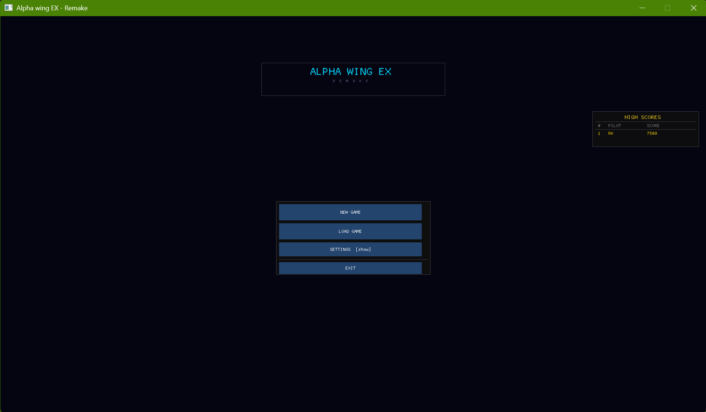
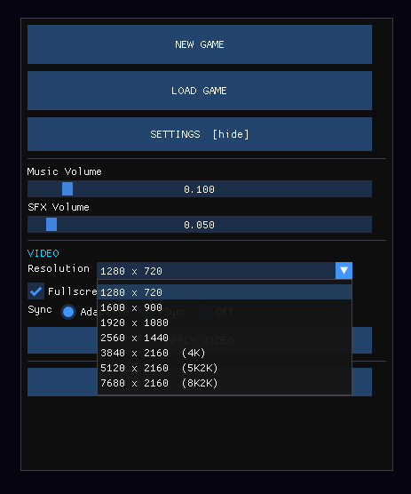
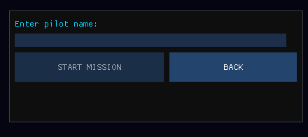
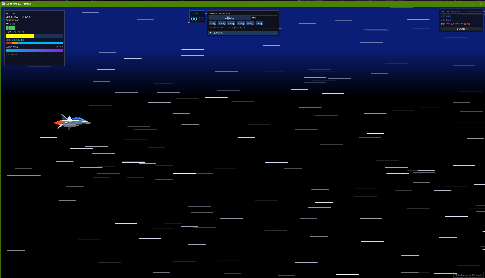
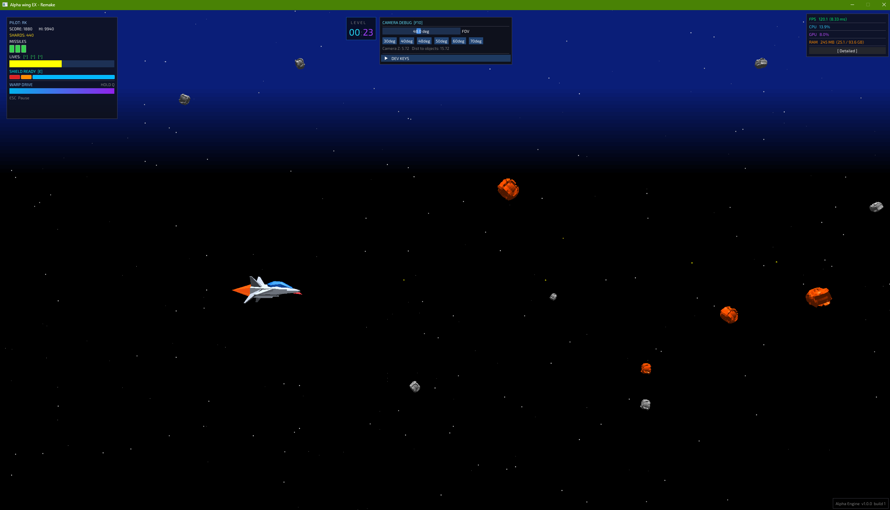
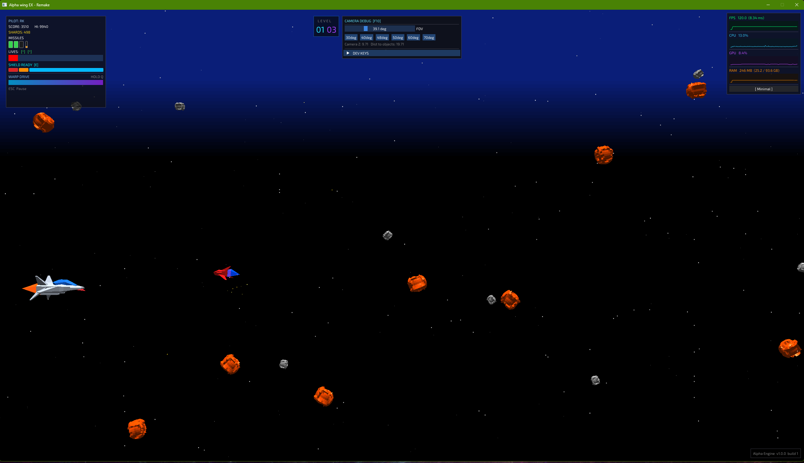
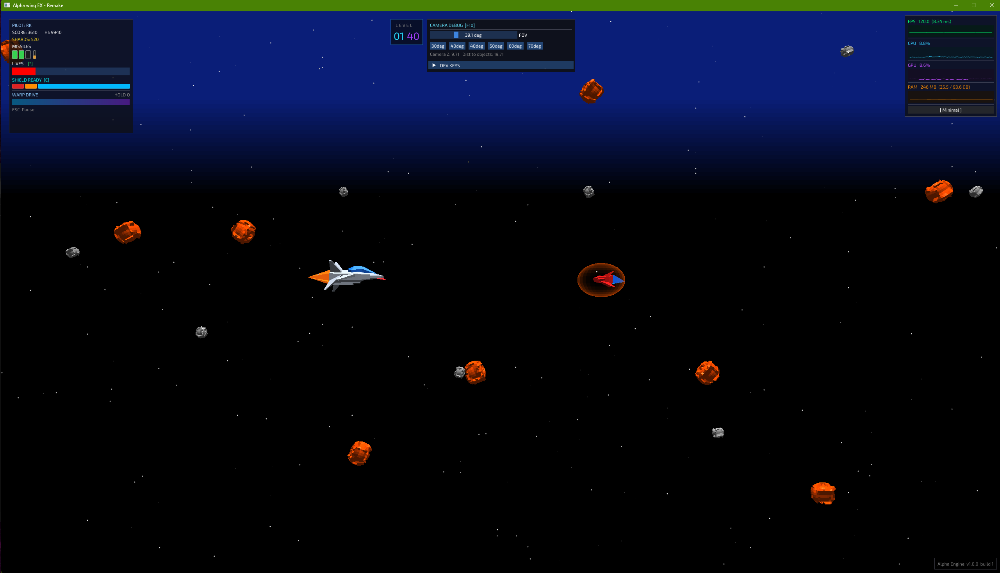
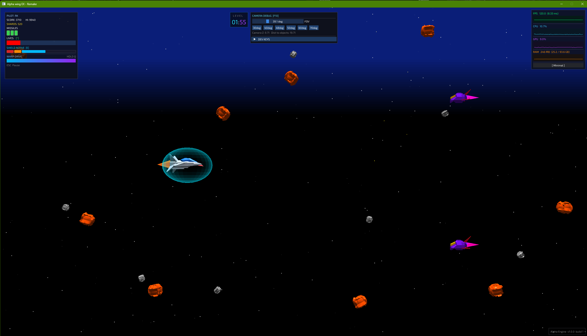
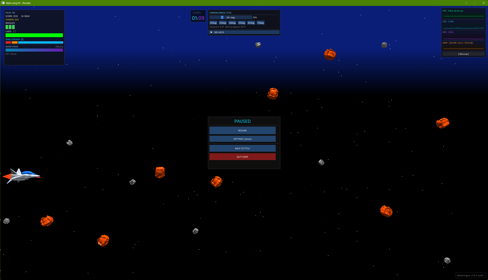
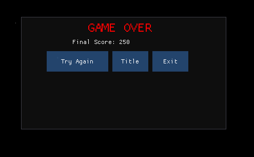

# AlphaWingEX-Remake

Just trying to recreate one of my favorite J2ME games in modern technology like OpenGL with C++

A 2.5D space shooter remake of classic J2ME mobile game Alpha Wing EX by Microspace,
rebuilt from the ground up in C++ with modern graphics and audio.

This is a personal project and midstone submission for Game Development at Humber College.
The original game was a childhood favorite, so I am trying to bring it to the new hardware and
audience to enjoy.

---

What is in this game?

- 3D models built in blender
- Vertical scrolling shooting and bullet hail
- TBA
    - Health System (done)
    - Enemy spawn (6+ types)
        - Asteroid (types)
        - Bot01 (variants)
        - Bot02
        - 
    - weapon
        - Laser (done)
        - Missiles (done)
        - Shield (done) + Ricochet bullets
        - 
- Background Music
    - Keeping the original chords with my own remix(working progress)
    - For now Level01 has an uplift beat from deadmau5, experimenting with tempo + gameplay sync mechanic(Experiment + work in progress)

---

Built with

- C++
- OpenGL
- SDL
- Custom Library (GameDev)
- ImGui
- Blender
- AKAI MPK mini mk4
- Ableton Live
- Logic Pro
- Audacity

---

How to run this on your PC?

- Download and install Visual Studio on windows, Probably need Microsoft Visual C++ library (other OS!, you are on your own for now)
- Setup GameDev library (find the GameDev.7z inside, extract it directly to your C drive "C:\GameDev")
- Clone/Download, Open ComponentFramework.sln in VS and run in x86
- Enjoy

---

How to play?

- W A S D for movement
- M1 to shoot/Spacebar
- M2 to missile
- E to use shield
- Q to Hyper Sonic Jump

---

# Screenshots

---

## Developer Documentation

| Document | What it covers |
|----------|---------------|
| [docs/ARCHITECTURE.md](docs/ARCHITECTURE.md) | Engine structure — frame loop, scene lifecycle, data flow |
| [docs/SYSTEMS.md](docs/SYSTEMS.md) | How each system works — level scripting, enemies, warp, save/load, audio, camera |
| [docs/HOW_TO_ADD.md](docs/HOW_TO_ADD.md) | Step-by-step recipes — add an enemy, a level, a HUD element, a save field |
| [docs/CONTROLS.md](docs/CONTROLS.md) | Every key binding — gameplay and debug shortcuts |

---

Sincerely,
Muntasir